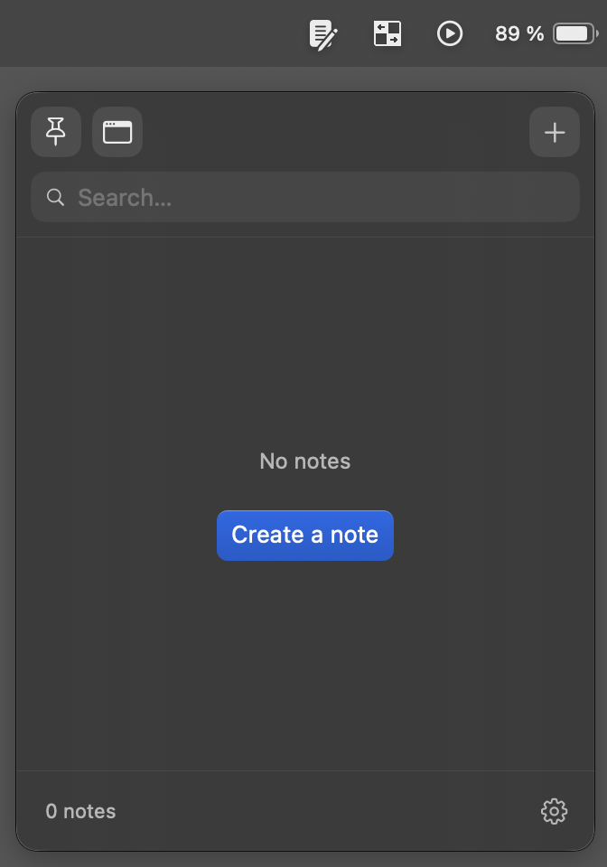
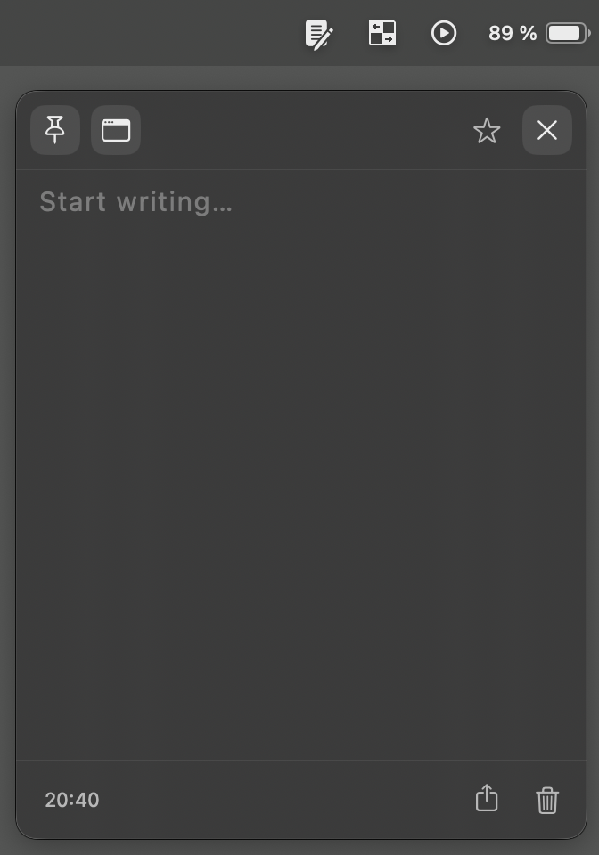
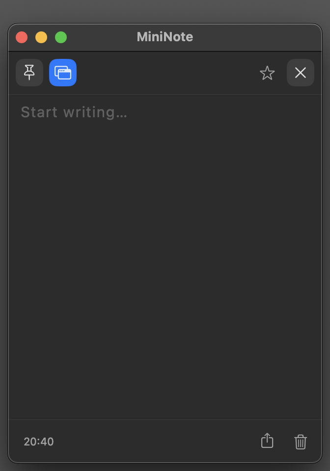
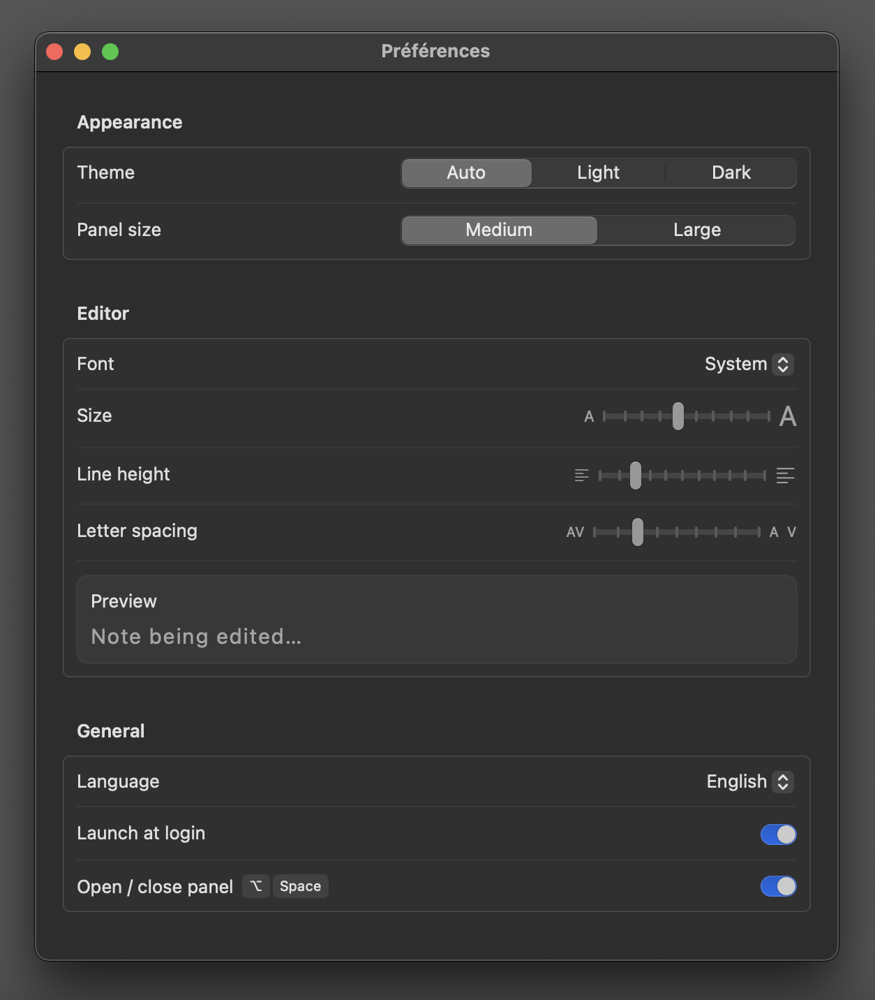

# MiniNoteNext

> A native macOS menubar note-taking app — built as a replacement for MiniNote by Fiplab,
> which is no longer available in some regions.

| Panel | Editor | Detached | Settings |
|-------|--------|----------|----------|
|  |  |  |  |

MiniNoteNext is a lightweight, keyboard-friendly note app that lives in your macOS menubar.
No cloud, no subscription — notes are stored locally using SwiftData.

## Features

- **Menubar panel** with two size presets (Medium / Large)
- **Note list** with favorites, full-text search (Cmd+F), and keyboard navigation
- **Plain text editor** with undo/redo and spell check
- **Context menu** — favorite, duplicate, copy content, share, or delete any note
- **Import / Export** notes as `.txt` files via the macOS menu bar
- **Customizable typography** — font family, size, line height, letter spacing
- **Optional global hotkey** (Option+Space) to open/close the panel from anywhere
- **Pin window** and detachable window mode
- **Light / dark / automatic** theme
- **Launch at login** support
- **French and English** localization

## Requirements

macOS 15.0 (Sequoia) or later

## Installation

1. Download `MiniNoteNext.zip` from the [Releases](../../releases) page
2. Unzip and drag `MiniNoteNext.app` to your Applications folder
3. **Right-click → Open** on first launch and confirm in the dialog

> **Why the warning?** The app is signed ad-hoc but not notarized by Apple (no paid developer account). macOS will show an "unidentified developer" warning on first launch. Two ways to bypass it:
>
> **Option A — Right-click → Open** (easiest)
> Right-click `MiniNoteNext.app` → **Open** → click **Open** in the dialog.
>
> **Option B — System Settings**
> System Settings → **Privacy & Security** → scroll down → click **Open Anyway** next to MiniNoteNext.
>
> **Option C — Terminal**
> ```bash
> xattr -cr /Applications/MiniNoteNext.app
> ```

## Build from source

```bash
git clone https://github.com/radiium/MiniNoteNext.git
cd MiniNoteNext
xcodebuild build \
  -project MiniNoteNext.xcodeproj \
  -scheme MiniNoteNext \
  -configuration Release
```

Requires Xcode 16.3+ and macOS 15.0+.

## License

MIT — see [LICENSE](LICENSE)

---

<sub>Built with the assistance of [Claude Code](https://claude.ai/code)</sub>
